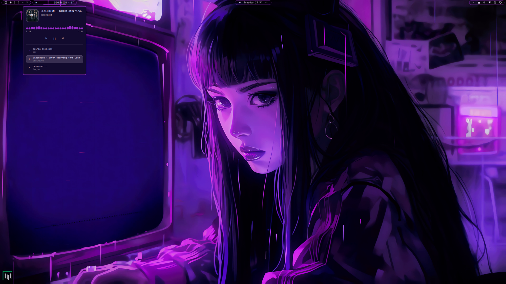
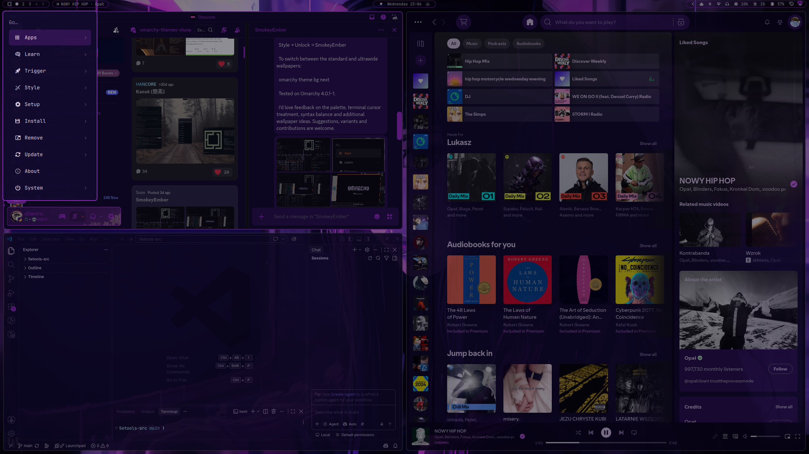
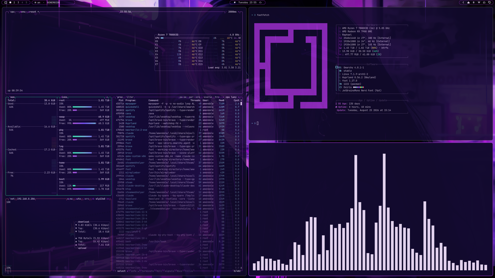
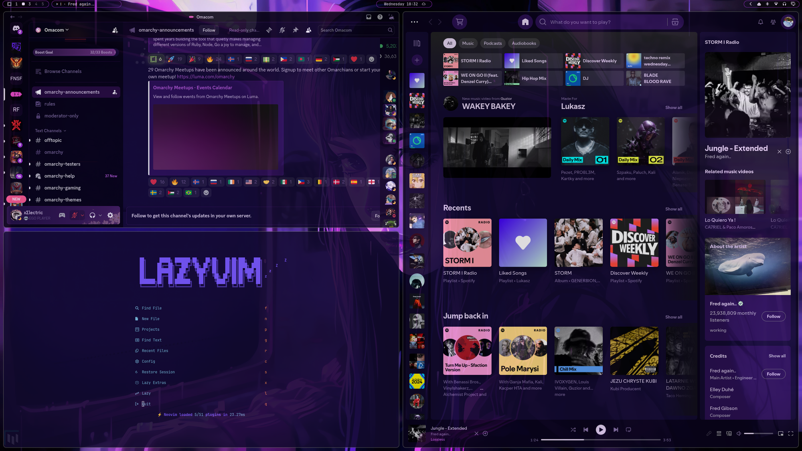

# Osiris Config

Personal [Omarchy](https://omarchy.org/) config: the **Osiris** theme (dark
indigo/violet, live animated wallpaper), a custom floating-islands status bar
with a now-playing pill (rounded art, live audio spectrum), an accent-lit
launcher menu, slide-out animations on every popup, a lock screen with a clock
and username, a retinted screensaver, a themed Neovim, and matching Spotify and
Discord themes.

Release history is in [`CHANGELOG.md`](CHANGELOG.md).

## Screenshots

Live wallpaper, floating-islands bar, and the now-playing pill open with its
audio-spectrum visualizer:



The launcher menu, anchored under the bar's left island and lit in accent
purple:



btop, fastfetch, and cava themed to match:



Discord, Neovim and Spotify carrying the same palette — note Discord's member
list collapsed to the avatar strip on its right edge, which expands on hover:



## What's here

```
.config/omarchy/
├── themes/osiris/            Theme: colors.toml + live wallpaper + static fallback
│   └── shell.menu.toml       Accent-purple override for the menu/clipboard/emoji card chrome
├── plugins/
│   ├── amendale.bar/         Custom bar (floating islands) — see its own README
│   ├── amendale.media/       Now-playing pill: rounded art, progress bar — see its own README
│   ├── amendale.lock/        Lock screen: clock + username above the wallpaper — see its own README
│   └── amendale.menu/        Launcher menu, anchored under the bar's left island — see its own README
├── hooks/theme-set.d/        Starts/stops the live wallpaper to match the active theme
├── hooks/post-boot.d/        Starts the live wallpaper at login — nothing else would
├── themed/                   Extra theme templates Omarchy doesn't ship by default
│   ├── fastfetch.jsonc.tpl   Themes fastfetch (untouched by Omarchy's own templates)
│   └── lazygit.yml.tpl       Themes lazygit's UI chrome (borders/selection/accents)
└── shell.json                Bar layout + transparency

.config/hypr/
└── looknfeel.lua             10% opacity on unfocused windows, 8px rounding system-wide

.config/spicetify/Themes/Osiris/
└── color.ini                  Spotify color scheme, mapped from colors.toml (not auto-synced)

.local/bin/
├── omarchy-screensaver       Retints all ~35 TTE screensaver effects to Osiris — see Install for why this lives here instead of a theme file
├── osiris-live-wallpaper     Launches the live wallpaper; shared by both hooks above
└── osiris-popup-animation    Springy slide-out for every bar popup — see POPUP-ANIMATION.md

.config/omarchy/hooks/post-update.d/
└── osiris-popup-animation.sh Re-applies the popup animation after each `omarchy update`

.config/cava/
└── config.osiris             Feeds the media pill's audio-spectrum visualizer

.config/vesktop/themes/
└── Osiris.theme.css          Discord theme (Vesktop/Vencord) — original, not a fork
```

Everything Omarchy already themes automatically from `colors.toml` — terminals
(Alacritty/Foot/Kitty/Ghostty), btop, VS Code, Chromium, Obsidian, keyboard RGB
— needs no extra files here; it just picks up
`themes/osiris/colors.toml` on `omarchy theme set osiris`. Starship also follows
automatically since it uses semantic ANSI color names rather than hex. Neovim is
the exception that looks automatic but isn't: Omarchy renders a full LazyVim
colorscheme spec into the theme output, but only reaches it through a symlink it
never creates retroactively — see the Install step above. The lock
screen is also already theme-reactive by default (only the clock/username are
custom, in `amendale.lock`) — note this system doesn't actually run `hyprlock`
at all; Omarchy replaced it with its own Quickshell lock screen (same for
`hypridle` — see `amendale.bar`'s README for that discovery), so a traditional
`hyprlock.conf` has no effect here.

## Requirements

- [Omarchy](https://omarchy.org/)
- [`mpvpaper`](https://github.com/GhostNaN/mpvpaper) (AUR) — plays the live
  wallpaper. Without it, Omarchy falls back to the static still image.
- [`cava`](https://github.com/karlstav/cava) (official repos, `pacman -S cava`)
  — powers the live audio-spectrum visualizer in the media pill's popup. Needs
  PipeWire (standard on Omarchy). Without it, that section just shows idle dots.
- [`spicetify-cli`](https://github.com/spicetify/cli) (AUR) — only needed if
  you also want the matching Spotify theme; everything else works without it.
- [Vesktop](https://github.com/Vencord/Vesktop) + [Vencord](https://vencord.dev/)
  — only needed for the Discord theme. Any Vencord-capable client works; it's a
  plain `.theme.css`.

## Install

```bash
cp -r .config/omarchy/themes/osiris ~/.config/omarchy/themes/
cp -r .config/omarchy/plugins/amendale.bar ~/.config/omarchy/plugins/
cp -r .config/omarchy/plugins/amendale.media ~/.config/omarchy/plugins/
cp -r .config/omarchy/plugins/amendale.lock ~/.config/omarchy/plugins/
cp -r .config/omarchy/plugins/amendale.menu ~/.config/omarchy/plugins/
cp .config/omarchy/hooks/theme-set.d/osiris-live-wallpaper-hook.sh ~/.config/omarchy/hooks/theme-set.d/
mkdir -p ~/.config/omarchy/hooks/post-boot.d
cp .config/omarchy/hooks/post-boot.d/osiris-live-wallpaper.sh ~/.config/omarchy/hooks/post-boot.d/
cp .config/omarchy/themed/*.tpl ~/.config/omarchy/themed/
cp .config/omarchy/shell.json ~/.config/omarchy/shell.json
cp .config/hypr/looknfeel.lua ~/.config/hypr/looknfeel.lua
mkdir -p ~/.config/cava && cp .config/cava/config.osiris ~/.config/cava/
mkdir -p ~/.local/bin && cp .local/bin/omarchy-screensaver .local/bin/osiris-live-wallpaper ~/.local/bin/
chmod +x ~/.config/omarchy/hooks/theme-set.d/osiris-live-wallpaper-hook.sh \
         ~/.config/omarchy/hooks/post-boot.d/osiris-live-wallpaper.sh \
         ~/.local/bin/omarchy-screensaver ~/.local/bin/osiris-live-wallpaper

# fastfetch/lazygit read their live config through a symlink into the current
# theme's rendered output, matching how Omarchy wires up btop — these aren't
# copied files, they need to be (re)created on any machine this is installed on:
ln -sf ~/.local/state/omarchy/current/theme/fastfetch.jsonc ~/.config/fastfetch/config.jsonc
ln -sf ~/.local/state/omarchy/current/theme/lazygit.yml ~/.config/lazygit/config.yml

# Neovim needs the same kind of link, but with a *relative* target — that is the
# exact spelling Omarchy's own migrations match on, so a future migration will
# recognise and maintain it. Note Omarchy only ever *repairs* this link and never
# creates one (both migrations open with `[[ -L $theme_link ]] || exit 0`), so a
# Neovim config that predates the Omarchy install silently stays on stock
# tokyonight forever:
ln -sfn ../../../../.local/state/omarchy/current/theme/neovim.lua ~/.config/nvim/lua/plugins/theme.lua

# Plus Omarchy's own two glue files — copied from /etc/skel rather than vendored
# here, so they track the omarchy-nvim package. Hot-reload retints an already-open
# Neovim when the theme changes; all-themes pre-declares the colorscheme plugins
# so switching doesn't stall on a clone.
cp /etc/skel/.config/nvim/lua/plugins/omarchy-theme-hotreload.lua \
   /etc/skel/.config/nvim/lua/plugins/all-themes.lua \
   ~/.config/nvim/lua/plugins/

omarchy theme set osiris
```

The screensaver script needs `~/.local/bin` to come *before* `$OMARCHY_PATH/bin`
in `PATH`, or the stock (un-retinted) `omarchy-screensaver` keeps winning. Add
this to **`~/.bash_profile`** specifically, not `~/.bashrc` — Hyprland's exec
dispatcher spawns login-but-non-interactive shells, which skip `.bashrc`'s
entire customization section (its first line returns immediately unless `$-`
contains `i`), but still run `.bash_profile` unconditionally:

```bash
echo 'export PATH="$HOME/.local/bin:$PATH"' >> ~/.bash_profile
```

No restart needed — the next screensaver launch re-resolves the command.

The custom bar needs one extra step `shell.json` can't express on its own: set
`"bar": {"id": "amendale.bar"}` (already in the copied `shell.json`) — Omarchy's
plugin-clone bar-swap path has a bug where a `required property` on the cloned
`Bar.qml`'s root item fails construction (see the plugin's own README); this
clone works around it, but if you re-clone from stock `omarchy.bar` on a fresh
machine, you'll hit that same bug and need to drop `required` from
`omarchyPath` / `barWidgetRegistry` / `barConfig` again.

Similarly, `amendale.media`'s `shell.json` entry (also already in the copied
file) is `{"id": "amendale.media"}`, and `amendale.bar`'s pill-splitting filters
on that exact id — if you ever re-clone the media widget under a different
name, both need updating together (see each plugin's own README for why).

`amendale.lock` needs no such manual step — it's a `service`-kind plugin, so
the copied `shell.json`'s `plugins` array already lists `{"id": "amendale.lock"}`
and disables the original the same way `omarchy plugin clone` would.

`amendale.menu` is likewise already wired up by the copied `shell.json` (bar
entry, `disabledPlugins`, `cloneSourceRestores`). Note that re-cloning it from
stock on a fresh machine does *not* rewrite the plugin's references to itself —
see its README for the two strings that need fixing by hand, both of which fail
silently.

The menu's purple chrome comes from `themes/osiris/shell.menu.toml`, not from
the plugin: Omarchy merges any `shell.<section>.toml` found in a theme
directory over the corresponding section of the generated `shell.toml`. It's
copied along with the rest of the theme, so it needs no separate step — but it
does mean the color and the placement live in two different files on purpose.

## Live wallpaper

`mpvpaper` plays `osiris-live.mp4` behind everything. Three details in
`.local/bin/osiris-live-wallpaper` are load-bearing rather than preference,
and all three were found the hard way:

**It runs on the `bottom` layer, not the default `background` layer.** Omarchy's
shell paints the still wallpaper on its own layer-shell surface,
`omarchy-background`, in the *background* layer — the same one `mpvpaper`
defaults to. Within a single layer Hyprland stacks by map order, so whichever
surface mapped last ends up on top. `mpvpaper` maps once, at boot or theme-set;
the shell remaps `omarchy-background` every time it restarts — an
`omarchy update`, a plugin reload, `omarchy restart shell`. After any of those
the still image lands on top and the video is buried, still decoding at ~35% CPU
and completely invisible. That looks exactly like "the wallpaper stopped
animating", which is what made it hard to place.

`-l bottom` puts it a whole layer level above `omarchy-background`, so the
ordering can't be lost to a race no matter what remaps or when. Normal windows
still draw above the bottom layer, so it behaves like a wallpaper in every other
respect. Confirm it with `hyprctl layers` — `mpvpaper` should be under
`Layer level 1 (bottom)` and `omarchy-background` under `Layer level 0`.

**It runs with `load-scripts=no`.** The `mpv-mpris` package symlinks its
plugin into mpv's *system-wide* script directory, so every mpv process registers
on D-Bus as a media player — the wallpaper included. It then turns up in the
now-playing popup as `osiris-live.mp4`, and not passively: a looping video is
permanently "playing" and starts before anything else, so the shell's
oldest-playing-wins tiebreak hands it the bar label over whatever music is
actually on. The media keys route through that same service, so play/pause could
land on the wallpaper too. The flag disables script auto-loading for this
instance only — mpv used normally keeps its MPRIS integration, and the
`mpv-mpris` package is untouched. Confirm with
`busctl --user list | grep mpris`: there should be no
`org.mpris.MediaPlayer2.mpv`.

**It starts from a `post-boot` hook, not just `theme-set`.** The theme-set hook
only fires when the theme actually changes, so on its own the live wallpaper
never comes back after a reboot — you get the static fallback until you
re-apply the theme by hand. The post-boot hook (run by Omarchy from Hyprland's
autostart, a couple of seconds in) reads the active theme itself and is a no-op
under any theme other than `osiris`.

Both hooks call the same script, so the flags exist in exactly one place.

## Popup animation (optional, needs root)

Every bar popup springs out of the bar rather than fading in place. This is
the one piece of this config that touches the packaged Omarchy tree — all the
popups funnel through two shared files in `/usr/share/omarchy/shell/Ui/`, and
there's no user-space override for them.

```bash
cp .local/bin/osiris-popup-animation ~/.local/bin/
cp .config/omarchy/hooks/post-update.d/osiris-popup-animation.sh ~/.config/omarchy/hooks/post-update.d/
chmod +x ~/.local/bin/osiris-popup-animation ~/.config/omarchy/hooks/post-update.d/osiris-popup-animation.sh

osiris-popup-animation apply    # prompts for sudo, restarts the shell
```

The hook re-applies it after every `omarchy update`, patching whatever the new
upstream version is — so this tracks upstream rather than freezing it. The
patcher is idempotent, backs up the originals, and aborts with a specific
error (changing nothing) if upstream ever moves the code it targets.
`osiris-popup-animation revert` undoes it. See
[`.local/bin/POPUP-ANIMATION.md`](.local/bin/POPUP-ANIMATION.md) for the full
reasoning and the alternative that was rejected.

Skipping this is fine — everything else works, popups just keep their stock
140ms fade. The launcher menu's slide is in `amendale.menu` and needs no patch.

## Spotify (optional)

```bash
mkdir -p ~/.config/spicetify/Themes/Osiris
cp .config/spicetify/Themes/Osiris/color.ini ~/.config/spicetify/Themes/Osiris/
spicetify config current_theme Osiris color_scheme Osiris
spicetify apply
```

Restart Spotify to see it — `spicetify apply` patches the installed app's
files on disk, so a copy already running won't pick up the change until then.

## Discord (optional)

An Osiris theme for Discord, via Vesktop/Vencord. Copy it into the themes
directory your client reads and enable it in **Settings → Themes**:

```bash
mkdir -p ~/.config/vesktop/themes
cp .config/vesktop/themes/Osiris.theme.css ~/.config/vesktop/themes/
```

`~/.config/Vencord/themes/` is the right target instead for a Vencord install
that isn't running under Vesktop.

This is **original work, not a fork** of any existing theme. Nearly all of the
colour comes from assigning Discord's own design tokens, which is why the whole
thing is under 300 lines: themes that instead brute-force `background-color`
against Discord's hashed class names (`.members_c8ffbb`) need well over a
thousand lines and break whenever Discord rebuilds a module.

Because Discord has renamed its tokens over time, both the current family
(`--background-base-*`, `--background-surface-*`) and the legacy one
(`--background-primary/secondary/tertiary`) are set. Whichever the running
client doesn't use is simply inert.

The one place tokens can't help is the **member list**, which collapses to a
60px strip and expands to 240px on hover. That needs class names, so it uses
substring selectors (`[class*="membersWrap_"]`) rather than the exact hashes —
a client rebuild that changes the hash suffix won't break it. The three names
can't cross-match, since `members_` isn't a substring of `membersWrap_` or
`membersGroup_` and the match is case-sensitive.

Nothing is fetched at runtime — no `@import`, no remote images.

## Credits and licence

The config, plugins, scripts, and docs here are GPL v3 (see [`LICENSE`](LICENSE)).

**The wallpaper is not ours.** `osiris-live.mp4` and the still frame derived
from it were downloaded from
[DesktopHut](https://www.desktophut.com/sad-purple-girl-live-wallpaper) and are
bundled so the theme works out of the box. We are not the author or copyright
holder, claim no ownership, and the GPL v3 above does not apply to them.

DesktopHut's copyright policy says only wallpapers watermarked
`© www.desktophut.com` are theirs and that everything else is "copyrighted by
their respective authors" — this video carries a watermark that isn't
DesktopHut's, so the original creator is someone we haven't been able to
identify. If you know who made it, please open an issue so they can be
credited properly. Rights holders: open an issue and it'll be removed.

Full detail in [`NOTICE`](NOTICE).
