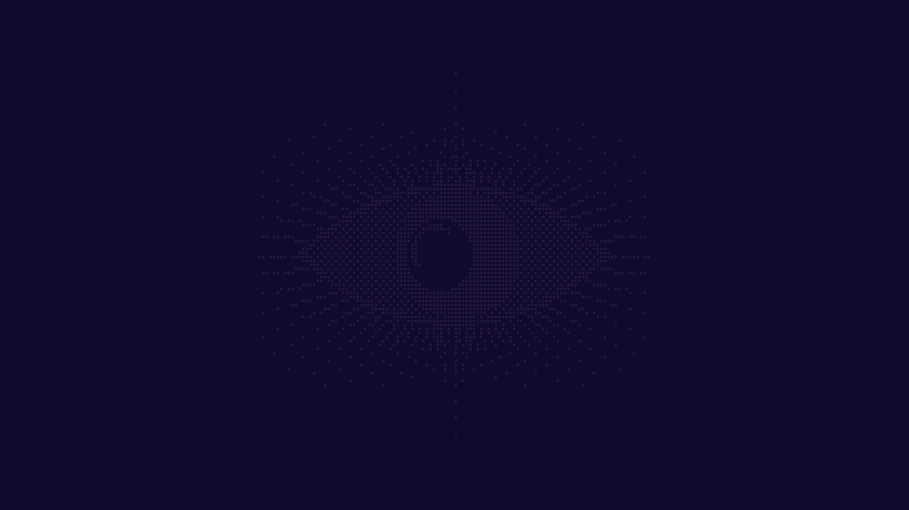
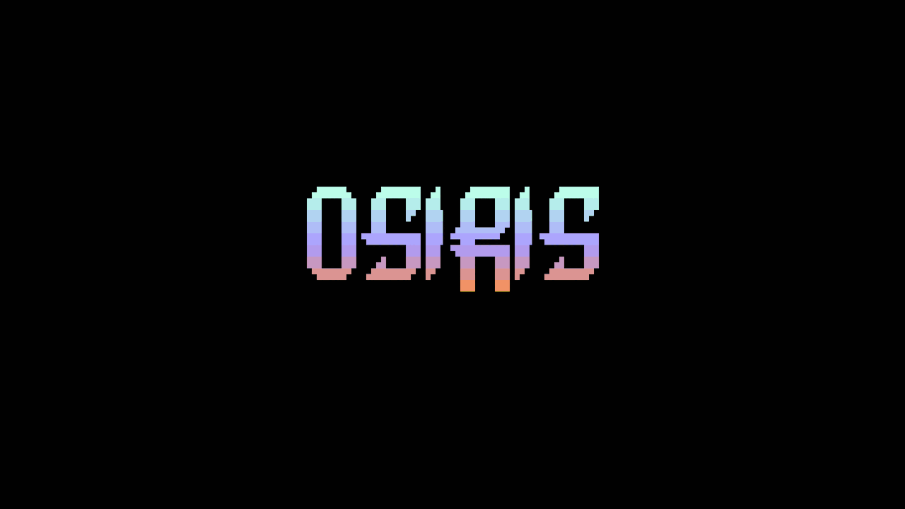

# Osiris Config

Personal [Omarchy](https://omarchy.org/) config: the **Osiris** theme (dark
indigo/violet, live animated wallpaper), a floating-islands status bar with a
now-playing pill (rounded art, live audio spectrum), an accent-lit launcher
menu, slide-out popup animations, a lock screen with clock + username, a
retinted screensaver, an OSIRIS glitch-reveal boot splash, a themed Neovim, and
matching Spotify and Discord themes.

Release history is in [`CHANGELOG.md`](CHANGELOG.md).

**Companion tool:**
[hypr-window-placement](https://github.com/xElectric9177/hypr-window-placement)
(own repo) — a small GUI/CLI for per-app Hyprland window-placement rules.

## Screenshots





## What's here

```
.config/omarchy/
├── themes/osiris/            Theme: colors.toml + live wallpaper + static fallback
│   └── shell.menu.toml       Accent-purple override for the menu/clipboard/emoji chrome
├── plugins/
│   ├── amendale.bar/         Custom bar (floating islands) — see its own README
│   ├── amendale.media/       Now-playing pill: rounded art, progress bar
│   ├── amendale.lock/        Lock screen: clock + username
│   ├── amendale.menu/        Launcher menu, anchored under the bar's left island
│   ├── amendale.cpu/         CPU load + package temp, click for btop
│   ├── amendale.gpu/         GPU load + edge temp, click for btop
│   ├── amendale.memory/      Memory in use, click for btop
│   └── amendale.notifications/ Bell + top-right box of uncleared notifications
├── hooks/theme-set.d/        Live wallpaper + fastfetch logo, following the active theme
├── hooks/post-boot.d/        Starts the live wallpaper at login
├── branding/                 Braille-eye fastfetch logo + OSIRIS wordmark art
├── themed/                   fastfetch + lazygit theme templates
└── shell.json                Bar layout + transparency

.config/hypr/looknfeel.lua        Unfocused-window opacity (media/games/video excepted); 8px rounding
.config/spicetify/…/color.ini     Spotify color scheme (not auto-synced)
.config/cava/config.osiris        Feeds the media pill's audio spectrum
.config/vesktop/themes/           Discord themes (Osiris + Osiris-DarkPlus)

.local/bin/
├── omarchy-screensaver       Retints the TTE screensaver effects to Osiris
├── osiris-eye-logo           Draws the braille eye logo
├── osiris-live-wallpaper     Launches the live wallpaper
├── osiris-plymouth-glitch    Builds/applies the boot theme (sudo; rebuilds initramfs)
└── osiris-popup-animation    Springy slide-out for bar popups — see POPUP-ANIMATION.md

.config/omarchy/hooks/post-update.d/   Reasserts the popup animation + boot theme after updates
```

Everything Omarchy themes from `colors.toml` (terminals, btop, VS Code,
Chromium, Obsidian, keyboard RGB, Starship) picks up the palette automatically
on `omarchy theme set osiris`. Neovim is the exception — it needs a symlink the
installer creates (see below). The lock screen and screensaver are handled by
Omarchy's Quickshell replacements, so `hyprlock.conf`/`hypridle` don't apply.

## Requirements

- [Omarchy](https://omarchy.org/)
- [`mpvpaper`](https://github.com/GhostNaN/mpvpaper) (AUR) — live wallpaper;
  without it, a static still is used.
- [`cava`](https://github.com/karlstav/cava) (`pacman -S cava`) — the media
  pill's audio spectrum; without it, that section shows idle dots.
- [`spicetify-cli`](https://github.com/spicetify/cli) (AUR) — only for the
  Spotify theme.
- [Vesktop](https://github.com/Vencord/Vesktop) + [Vencord](https://vencord.dev/)
  — only for the Discord theme (a plain `.theme.css`).

## Install

One command — clone and run:

```bash
git clone https://github.com/xElectric9177/Osiris && ~/Osiris/install.sh
# or:  curl -fsSL https://raw.githubusercontent.com/xElectric9177/Osiris/main/install.sh | bash
```

It installs the whole desktop (theme, bar, plugins, hooks, scripts, branding,
editor links), then interactively offers the pieces that need `sudo` or touch
other apps — boot animation, popup animation, Spotify and Discord themes (all
default to *no*). It checks for `cava`/`mpvpaper` and offers to install them,
is safe to re-run, and backs up `shell.json` and `looknfeel.lua`. Piped through
`curl | bash`, every prompt takes its default (core in, extras skipped).

**Just want the colours?** `install-theme.sh` installs *only* the theme
(palette + wallpaper) — no bar, plugins, scripts, or boot animation:

```bash
git clone https://github.com/xElectric9177/Osiris && ~/Osiris/install-theme.sh
# or:  curl -fsSL https://raw.githubusercontent.com/xElectric9177/Osiris/main/install-theme.sh | bash
```

### Manual install

The installer is the executable form of these steps; run them by hand to pick
and choose:

```bash
# theme + plugins + hooks + config
cp -r .config/omarchy/themes/osiris ~/.config/omarchy/themes/
cp -r .config/omarchy/plugins/amendale.* ~/.config/omarchy/plugins/
cp .config/omarchy/hooks/theme-set.d/*.sh ~/.config/omarchy/hooks/theme-set.d/
mkdir -p ~/.config/omarchy/hooks/post-boot.d
cp .config/omarchy/hooks/post-boot.d/*.sh ~/.config/omarchy/hooks/post-boot.d/
cp .config/omarchy/themed/*.tpl ~/.config/omarchy/themed/
cp .config/omarchy/shell.json ~/.config/omarchy/shell.json
cp .config/hypr/looknfeel.lua ~/.config/hypr/looknfeel.lua
cp -r .config/omarchy/branding/* ~/.config/omarchy/branding/
mkdir -p ~/.config/cava && cp .config/cava/config.osiris ~/.config/cava/
mkdir -p ~/.local/bin && cp .local/bin/omarchy-screensaver .local/bin/osiris-* ~/.local/bin/
chmod +x ~/.local/bin/osiris-* ~/.local/bin/omarchy-screensaver \
         ~/.config/omarchy/hooks/*/osiris-*.sh

# ~/.local/bin must precede $OMARCHY_PATH/bin, and in .bash_profile (not .bashrc)
# so Hyprland's exec dispatcher picks it up — needed for the retinted screensaver:
echo 'export PATH="$HOME/.local/bin:$PATH"' >> ~/.bash_profile

# editor theme links (neovim's target must be *relative* — Omarchy's migrations match on that spelling)
mkdir -p ~/.config/fastfetch ~/.config/lazygit ~/.config/nvim/lua/plugins
ln -sf  ~/.local/state/omarchy/current/theme/fastfetch.jsonc ~/.config/fastfetch/config.jsonc
ln -sf  ~/.local/state/omarchy/current/theme/lazygit.yml     ~/.config/lazygit/config.yml
ln -sfn ../../../../.local/state/omarchy/current/theme/neovim.lua ~/.config/nvim/lua/plugins/theme.lua
cp /etc/skel/.config/nvim/lua/plugins/omarchy-theme-hotreload.lua \
   /etc/skel/.config/nvim/lua/plugins/all-themes.lua ~/.config/nvim/lua/plugins/

# apply
omarchy-shell shell rescanPlugins && omarchy restart shell
omarchy theme set osiris
```

The custom bar and media pill are wired up by the copied `shell.json`; on a
fresh re-clone from stock plugins, watch for the `required`-property bar-swap
bug and the self-referencing plugin ids — details are in each plugin's own
README.

## The pieces

Each subsystem has its full write-up in its plugin README or a dedicated doc;
short version:

- **Live wallpaper** — `mpvpaper` plays `osiris-live.mp4` on the `bottom` layer
  with `load-scripts=no` (keeps it off the MPRIS bus), started by both a
  theme-set and a post-boot hook. Confirm with `hyprctl layers | grep mpvpaper`.
- **fastfetch logo** — a braille eye drawn straight to the logo grid (not
  transcoded), recoloured per theme, swapped in only under Osiris by a hook.
- **Notification center** (`amendale.notifications`) — a bar bell + top-right box
  reading Omarchy's own notification history (capped at 10). Toggle:
  `qs -p "$OMARCHY_PATH/shell" ipc call amendale.notifications toggle`.
- **Popup animation** (optional, sudo) — patches the packaged Omarchy shell so
  bar popups spring out; a post-update hook re-applies it, `revert` undoes it.
  See [`.local/bin/POPUP-ANIMATION.md`](.local/bin/POPUP-ANIMATION.md).
- **Spotify** (optional) — `spicetify config current_theme Osiris color_scheme
  Osiris && spicetify apply` (restart Spotify).
- **Discord** (optional) — copy a `.theme.css` from `.config/vesktop/themes/`
  and enable it in **Settings → Themes**. `Osiris.theme.css` is original work;
  `Osiris-DarkPlus.theme.css` thin-imports and recolours
  [DevEvil's Dark+](https://github.com/DevEvil99/DarkPlus-Discord-Theme) (used
  with permission — needs network on load; see `NOTICE`).

## Credits and licence

The config, plugins, scripts, and docs here are GPL v3 (see [`LICENSE`](LICENSE)).

**The wallpaper is not ours.** `osiris-live.mp4` and its still frame were
downloaded from
[DesktopHut](https://www.desktophut.com/sad-purple-girl-live-wallpaper) and are
bundled so the theme works out of the box — we claim no ownership, and the GPL
above doesn't apply to them. The watermark isn't DesktopHut's and we couldn't
identify the original creator; if you know who made it, open an issue so they
can be credited (or a rights holder, so it can be removed). Full detail in
[`NOTICE`](NOTICE).
